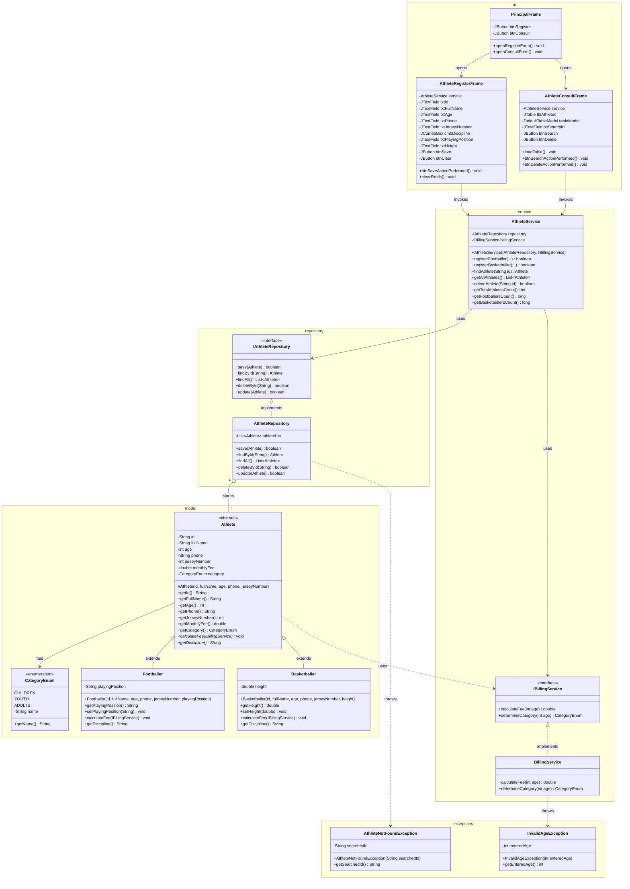

# Class Diagram

```mermaid
classDiagram
    namespace model {
        class CategoryEnum {
            <<enumeration>>
            CHILDREN
            YOUTH
            ADULTS
            -String name
            +getName() String
        }
        class Athlete {
            <<abstract>>
            -String id
            -String fullName
            -int age
            -String phone
            -int jerseyNumber
            -double monthlyFee
            -CategoryEnum category
            #Athlete(id, fullName, age, phone, jerseyNumber)
            +getId() String
            +getFullName() String
            +getAge() int
            +getPhone() String
            +getJerseyNumber() int
            +getMonthlyFee() double
            +getCategory() CategoryEnum
            +calculateFee(IBillingService)* void
            +getDiscipline()* String
        }
        class Footballer {
            -String playingPosition
            +Footballer(id, fullName, age, phone, jerseyNumber, playingPosition)
            +getPlayingPosition() String
            +setPlayingPosition(String) void
            +calculateFee(IBillingService) void
            +getDiscipline() String
        }
        class Basketballer {
            -double height
            +Basketballer(id, fullName, age, phone, jerseyNumber, height)
            +getHeight() double
            +setHeight(double) void
            +calculateFee(IBillingService) void
            +getDiscipline() String
        }
    }

    namespace exceptions {
        class AthleteNotFoundException {
            -String searchedId
            +AthleteNotFoundException(String searchedId)
            +getSearchedId() String
        }
        class InvalidAgeException {
            -int enteredAge
            +InvalidAgeException(int enteredAge)
            +getEnteredAge() int
        }
    }

    namespace repository {
        class IAthleteRepository {
            <<interface>>
            +save(Athlete) boolean
            +findById(String) Athlete
            +findAll() List~Athlete~
            +deleteById(String) boolean
            +update(Athlete) boolean
        }
        class AthleteRepository {
            -List~Athlete~ athleteList
            +save(Athlete) boolean
            +findById(String) Athlete
            +findAll() List~Athlete~
            +deleteById(String) boolean
            +update(Athlete) boolean
        }
    }

    namespace service {
        class IBillingService {
            <<interface>>
            +calculateFee(int age) double
            +determineCategory(int age) CategoryEnum
        }
        class BillingService {
            +calculateFee(int age) double
            +determineCategory(int age) CategoryEnum
        }
        class AthleteService {
            -IAthleteRepository repository
            -IBillingService billingService
            +AthleteService(IAthleteRepository, IBillingService)
            +registerFootballer(...) boolean
            +registerBasketballer(...) boolean
            +findAthlete(String id) Athlete
            +getAllAthletes() List~Athlete~
            +deleteAthlete(String id) boolean
            +getTotalAthletesCount() int
            +getFootballersCount() long
            +getBasketballersCount() long
        }
    }

    namespace ui {
        class PrincipalFrame {
            -JButton btnRegister
            -JButton btnConsult
            +openRegisterForm() void
            +openConsultForm() void
        }
        class AthleteRegisterFrame {
            -AthleteService service
            -JTextField txtId
            -JTextField txtFullName
            -JTextField txtAge
            -JTextField txtPhone
            -JTextField txtJerseyNumber
            -JComboBox cmbDiscipline
            -JTextField txtPlayingPosition
            -JTextField txtHeight
            -JButton btnSave
            -JButton btnClear
            +btnSaveActionPerformed() void
            +clearFields() void
        }
        class AthleteConsultFrame {
            -AthleteService service
            -JTable tblAthletes
            -DefaultTableModel tableModel
            -JTextField txtSearchId
            -JButton btnSearch
            -JButton btnDelete
            +loadTable() void
            +btnSearchActionPerformed() void
            +btnDeleteActionPerformed() void
        }
    }

    Athlete <|-- Footballer : extends
    Athlete <|-- Basketballer : extends
    Athlete --> CategoryEnum : has
    Athlete ..> IBillingService : uses
    IAthleteRepository <|.. AthleteRepository : implements
    IBillingService <|.. BillingService : implements
    AthleteRepository "1" o-- "*" Athlete : stores
    AthleteService --> IAthleteRepository : uses
    AthleteService --> IBillingService : uses
    AthleteRepository ..> AthleteNotFoundException : throws
    BillingService ..> InvalidAgeException : throws
    PrincipalFrame --> AthleteRegisterFrame : opens
    PrincipalFrame --> AthleteConsultFrame : opens
    AthleteRegisterFrame --> AthleteService : invokes
    AthleteConsultFrame --> AthleteService : invokes
```