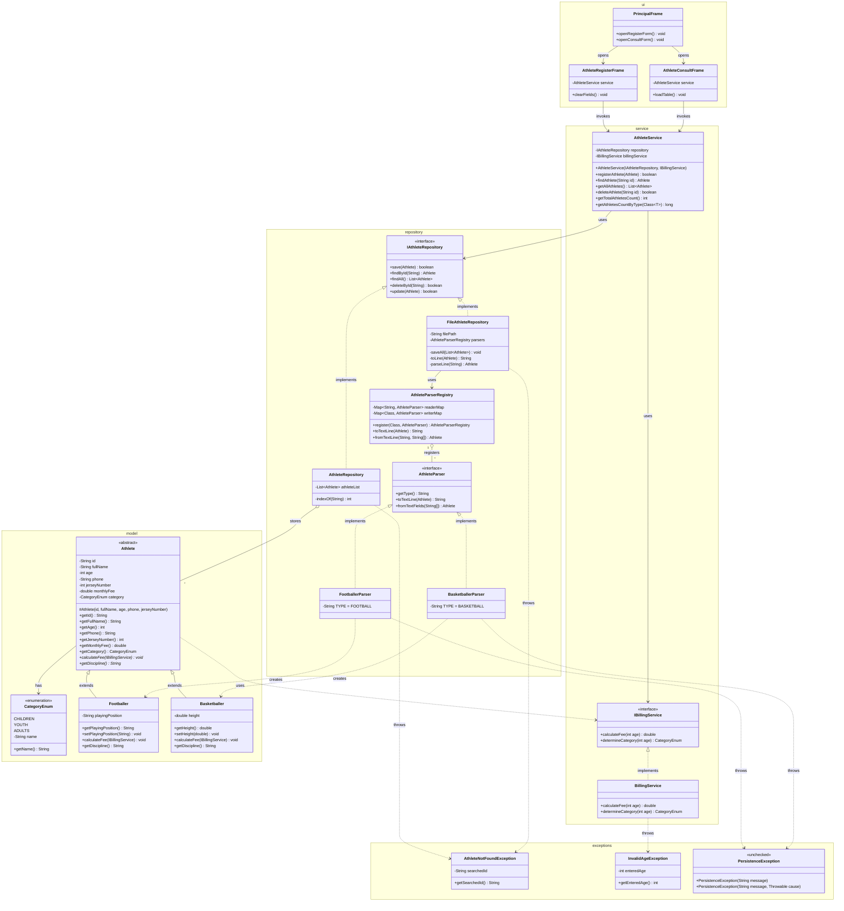

# Class Diagram

```mermaid
classDiagram
    direction TB
    namespace model {
        class CategoryEnum {
            <<enumeration>>
            CHILDREN
            YOUTH
            ADULTS
            -String name
            +getName() String
        }
        class Athlete {
            <<abstract>>
            -String id
            -String fullName
            -int age
            -String phone
            -int jerseyNumber
            -double monthlyFee
            -CategoryEnum category
            #Athlete(id, fullName, age, phone, jerseyNumber)
            +getId() String
            +getFullName() String
            +getAge() int
            +getPhone() String
            +getJerseyNumber() int
            +getMonthlyFee() double
            +getCategory() CategoryEnum
            +calculateFee(IBillingService)* void
            +getDiscipline()* String
        }
        class Footballer {
            -String playingPosition
            +getPlayingPosition() String
            +setPlayingPosition(String) void
            +calculateFee(IBillingService) void
            +getDiscipline() String
        }
        class Basketballer {
            -double height
            +getHeight() double
            +setHeight(double) void
            +calculateFee(IBillingService) void
            +getDiscipline() String
        }
    }

    namespace exceptions {
        class AthleteNotFoundException {
            -String searchedId
            +getSearchedId() String
        }
        class InvalidAgeException {
            -int enteredAge
            +getEnteredAge() int
        }
        class PersistenceException {
            <<unchecked>>
            +PersistenceException(String message)
            +PersistenceException(String message, Throwable cause)
        }
    }

    namespace repository {
        class IAthleteRepository {
            <<interface>>
            +save(Athlete) boolean
            +findById(String) Athlete
            +findAll() List~Athlete~
            +deleteById(String) boolean
            +update(Athlete) boolean
        }
        class AthleteRepository {
            -List~Athlete~ athleteList
            -indexOf(String) int
        }
        class FileAthleteRepository {
            -String filePath
            -AthleteParserRegistry parsers
            -saveAll(List~Athlete~) void
            -toLine(Athlete) String
            -parseLine(String) Athlete
        }
        class AthleteParser {
            <<interface>>
            +getType() String
            +toTextLine(Athlete) String
            +fromTextFields(String[]) Athlete
        }
        class AthleteParserRegistry {
            -Map~String, AthleteParser~ readerMap
            -Map~Class, AthleteParser~ writerMap
            +register(Class, AthleteParser) AthleteParserRegistry
            +toTextLine(Athlete) String
            +fromTextLine(String, String[]) Athlete
        }
        class FootballerParser {
            -String TYPE = FOOTBALL
        }
        class BasketballerParser {
            -String TYPE = BASKETBALL
        }
    }

    namespace service {
        class IBillingService {
            <<interface>>
            +calculateFee(int age) double
            +determineCategory(int age) CategoryEnum
        }
        class BillingService {
            +calculateFee(int age) double
            +determineCategory(int age) CategoryEnum
        }
        class AthleteService {
            -IAthleteRepository repository
            -IBillingService billingService
            +AthleteService(IAthleteRepository, IBillingService)
            +registerAthlete(Athlete) boolean
            +findAthlete(String id) Athlete
            +getAllAthletes() List~Athlete~
            +deleteAthlete(String id) boolean
            +getTotalAthletesCount() int
            +getAthletesCountByType(Class~T~) long
        }
    }

    namespace ui {
        class PrincipalFrame {
            +openRegisterForm() void
            +openConsultForm() void
        }
        class AthleteRegisterFrame {
            -AthleteService service
            +clearFields() void
        }
        class AthleteConsultFrame {
            -AthleteService service
            +loadTable() void
        }
    }

    Athlete <|-- Footballer : extends
    Athlete <|-- Basketballer : extends
    Athlete --> CategoryEnum : has
    Athlete ..> IBillingService : uses
    IAthleteRepository <|.. AthleteRepository : implements
    IAthleteRepository <|.. FileAthleteRepository : implements
    AthleteParser <|.. FootballerParser : implements
    AthleteParser <|.. BasketballerParser : implements
    IBillingService <|.. BillingService : implements
    AthleteRepository "1" o-- "*" Athlete : stores
    FileAthleteRepository --> AthleteParserRegistry : uses
    AthleteParserRegistry "1" o-- "*" AthleteParser : registers
    FootballerParser ..> Footballer : creates
    BasketballerParser ..> Basketballer : creates
    FootballerParser ..> PersistenceException : throws
    BasketballerParser ..> PersistenceException : throws
    AthleteService --> IAthleteRepository : uses
    AthleteService --> IBillingService : uses
    AthleteRepository ..> AthleteNotFoundException : throws
    FileAthleteRepository ..> AthleteNotFoundException : throws
    BillingService ..> InvalidAgeException : throws
    PrincipalFrame --> AthleteRegisterFrame : opens
    PrincipalFrame --> AthleteConsultFrame : opens
    AthleteRegisterFrame --> AthleteService : invokes
    AthleteConsultFrame --> AthleteService : invokes
```