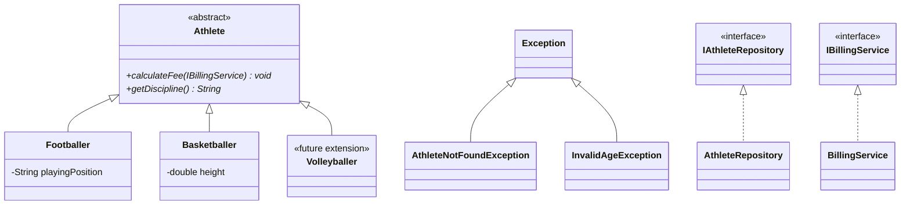

# Inheritance Hierarchy

```mermaid
classDiagram
    class Athlete {
        <<abstract>>
        +calculateFee(IBillingService)* void
        +getDiscipline()* String
    }
    class Footballer {
        -String playingPosition
    }
    class Basketballer {
        -double height
    }
    class Volleyballer {
        <<future extension>>
    }
    Athlete <|-- Footballer
    Athlete <|-- Basketballer
    Athlete <|-- Volleyballer

    class Exception
    class AthleteNotFoundException
    class InvalidAgeException
    Exception <|-- AthleteNotFoundException
    Exception <|-- InvalidAgeException

    class IAthleteRepository {
        <<interface>>
    }
    class AthleteRepository
    IAthleteRepository <|.. AthleteRepository

    class IBillingService {
        <<interface>>
    }
    class BillingService
    IBillingService <|.. BillingService
```

`Volleyballer` is not implemented: it only shows how the hierarchy can grow
without modifying existing code (Open/Closed Principle).